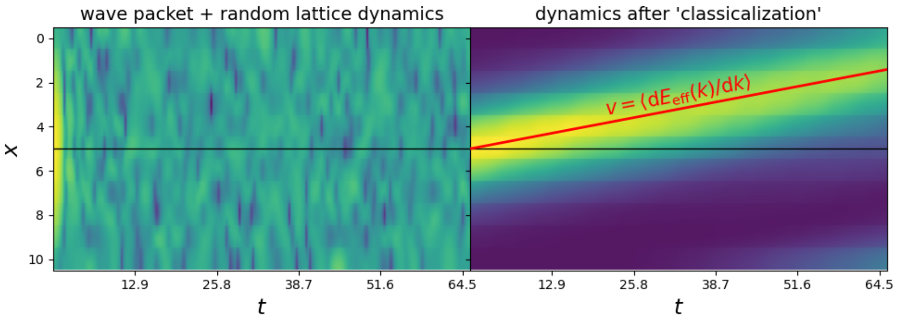
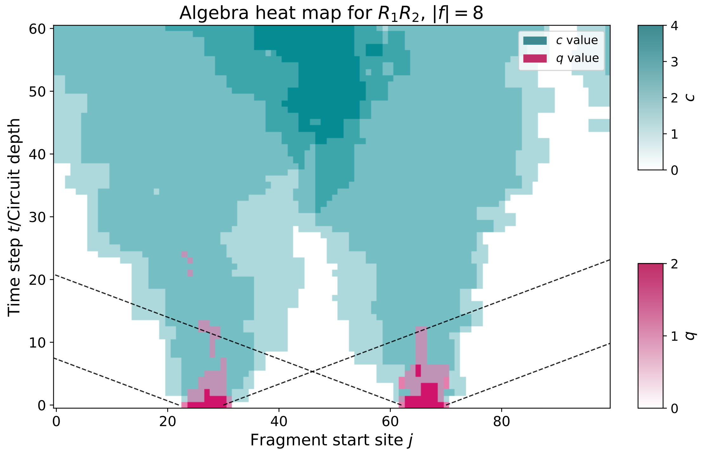
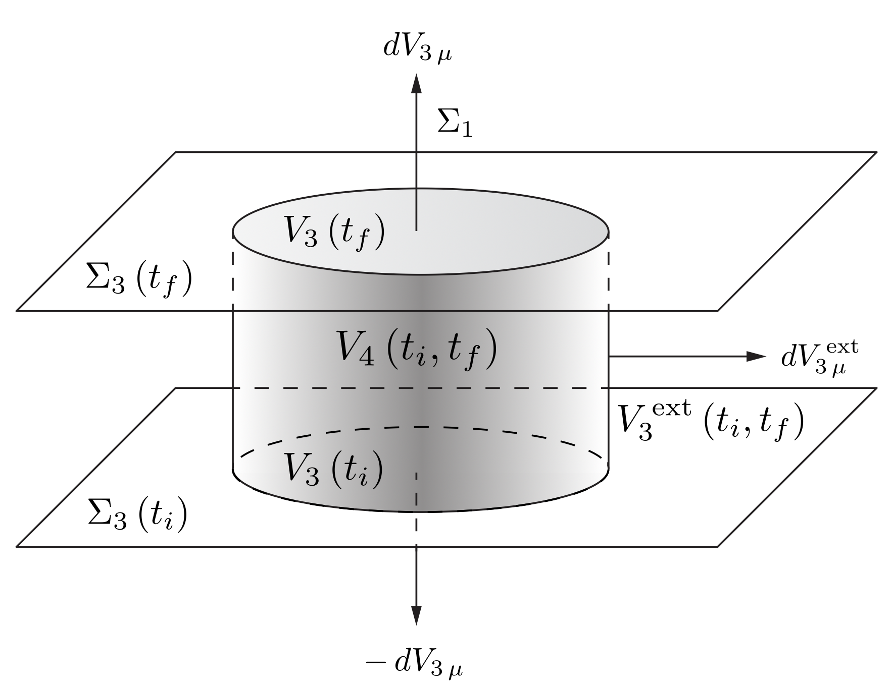

<!-- Edit note: this is the first page visitors see. Keep the first paragraph short and update the link row when your profiles change. -->

::: {.home-hero}
::: {.hero-copy}

PhD student in physics · Virginia Tech

::: {.hero-intro}
I do quantum stuff
:::

Second-year PhD student in ChunJun Cao's group at Virginia Tech. My current interests include quantum error correction, quantum Darwinism and objectivity, quantum mereology, quantum gravity, and quantum computing.

::: {.link-row}
[Google Scholar](https://scholar.google.com/citations?user=8xDZ2dcAAAAJ&hl=en) · [Email](mailto:mcgirard@vt.edu) · [CV](cv.pdf)
:::
:::

::: {.profile-stack}
{.hero-photo}

::: {.profile-caption}
These are belay glasses; I like climbing.
:::
:::
:::

## Papers

::: {.pub-card}
{.pub-image}

::: {.pub-copy}

arXiv:2606.10004 · 2026

### Wave packets from the spectrum

ChunJun Cao, Oliver Friedrich, **Marin Girard**, Nicolas Loizeau, and Ashmeet Singh

We show how a Hamiltonian can be represented in a basis where dynamics look more local, producing wave-packet behavior and suggesting a route toward quantum mereology for fields.

[arXiv](https://arxiv.org/abs/2606.10004)
:::
:::

::: {.pub-card}
{.pub-image}

::: {.pub-copy}

arXiv:2606.06588 · 2026

### Demystifying Objectivity with Operator Algebra Quantum Error Correction

**Marin Girard**, Gong Cheng, and ChunJun Cao

We connect quantum Darwinism with operator algebra quantum error correction, making objectivity into a local recoverability question and giving computable tools for studying classicality and redundancy.

[arXiv](https://arxiv.org/abs/2606.06588)
:::
:::

::: {.pub-card}
{.pub-image}

::: {.pub-copy}

arXiv:2210.04282 · 2022

### Relativistic thermodynamics of perfect fluids

Sylvain D. Brechet and **Marin C. A. Girard**

We develop a covariant thermodynamic description for relativistic perfect fluids, including relativistic continuity equations and transformation laws for thermodynamic quantities.

[arXiv](https://arxiv.org/abs/2210.04282)
:::
:::
